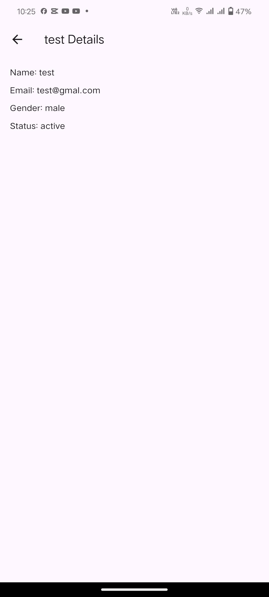
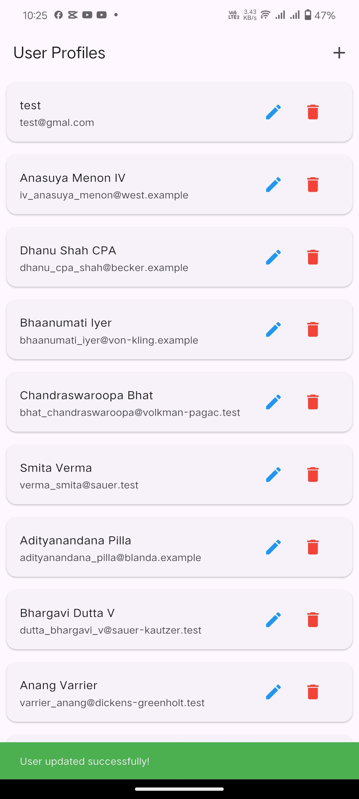
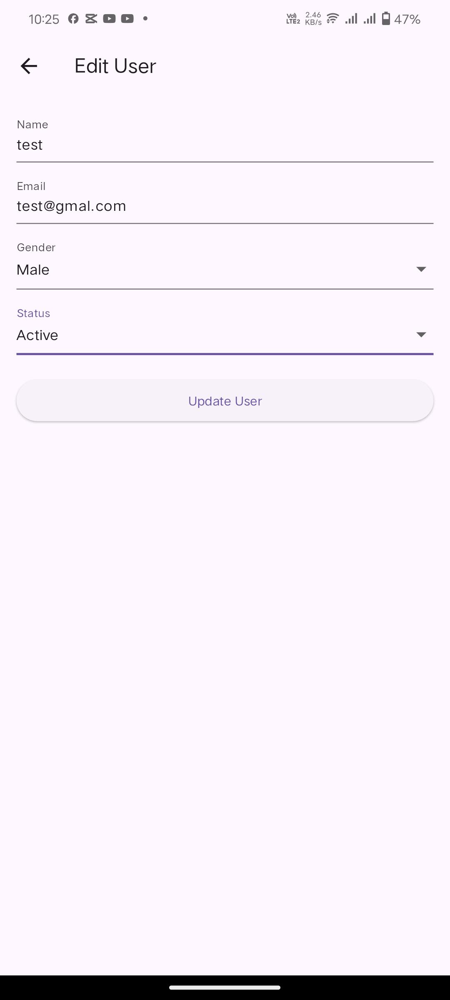
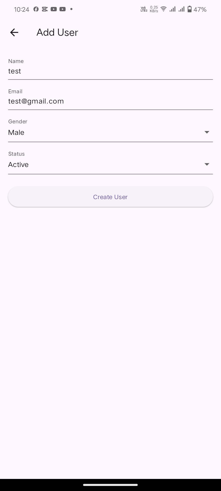

# user_profile_management

A Flutter application to manage user profiles, supporting CRUD (Create, Read, Update, Delete)
operations using the [GoRest API](https://gorest.co.in/). 
The app includes advanced features like caching, error handling, and a responsive UI.

---

## Features
- Fetch user profiles from the API.
- Add new user profiles.
- Update existing user profiles.
- Delete user profiles.
- Cache data locally using SharedPreferences.
- Handle API errors gracefully with Dio and try-catch.
- Navigate between screens while maintaining app state.

---

## Screens
|  |  |  |  |

---

## Technologies Used
- Flutter: Framework for building cross-platform mobile applications.
- Dio: HTTP client for API calls.
- SharedPreferences: For local data caching.
- GoRest API: A RESTful API used to manage user data.
- Responsive UI: Designed to work seamlessly on various screen sizes.

---

## Getting Started

### Prerequisites
- Flutter SDK installed. [Installation Guide](https://flutter.dev/docs/get-started/install)
- A valid API token from GoRest. Generate one [here](https://gorest.co.in/consumer/login).

### Installation
1. Clone the repository from github
2. Run the app
   
